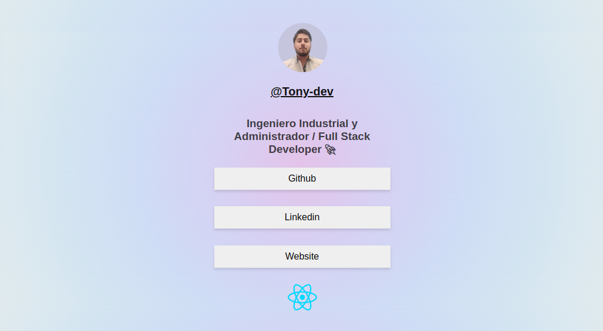
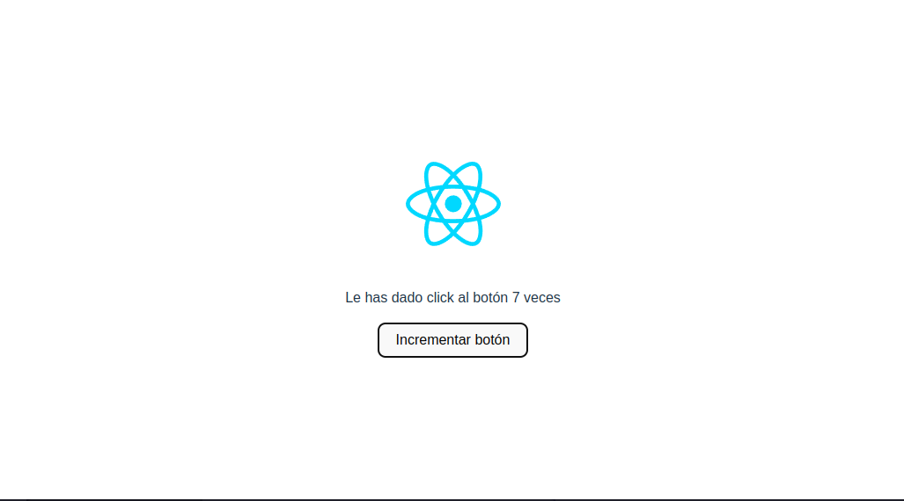
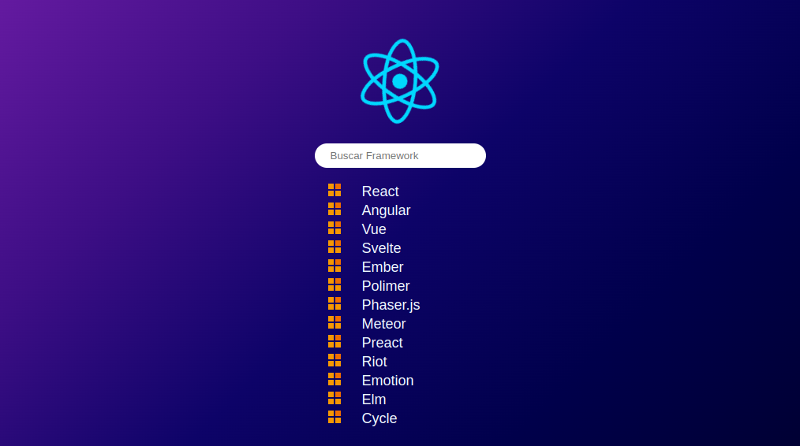
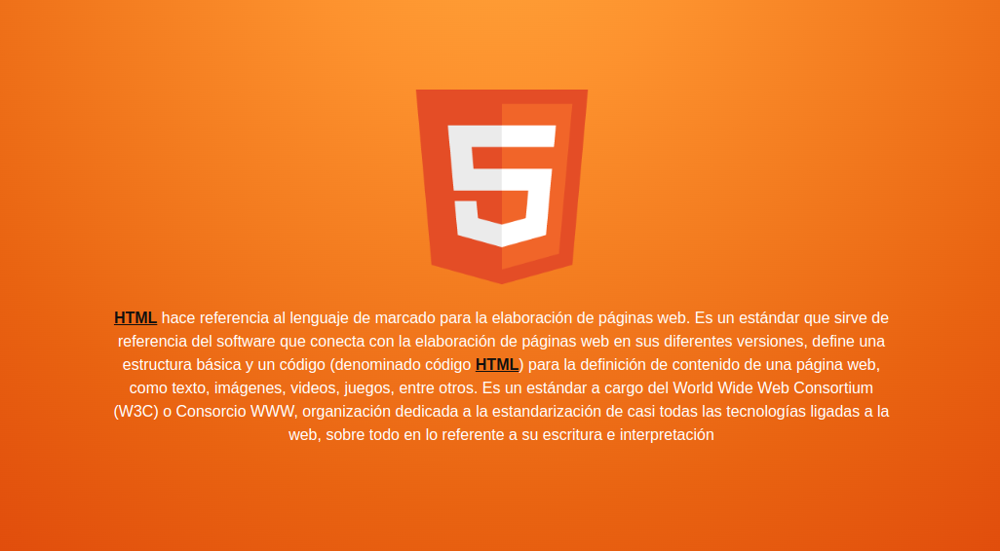

# Mini Proyectos con ReactJS

  <h1>👽 Proyectos</h1>
  <strong>Documentación del proyecto y marcos de trabajo que se utilizan</strong> 

 

### 🏗 Equipo de Ingeniería  

- [@T0ny-dev](https://github.com/T0ny-dev)

### 👨‍💻 Listados de marcos de trabajo

* ReactJS
* Vite

### 💻 Listados comandos 

* `npm run dev `  iniciara el servidor para vista previa en localhost:5173
* `npm i `  instalara dependencias

### 🗎 descargar de proyecto

* para descargar `git clone` y instalar dependencias de cada carperta de proyectos `npm install`

### 🗎 Proyectos capturas

## 01-Hola Mundo

## 02-Tarjeta-presentacion

## 03-Contador

## 04-Temporizador

## 05-Filtrar listas

## 06-Tooltip

